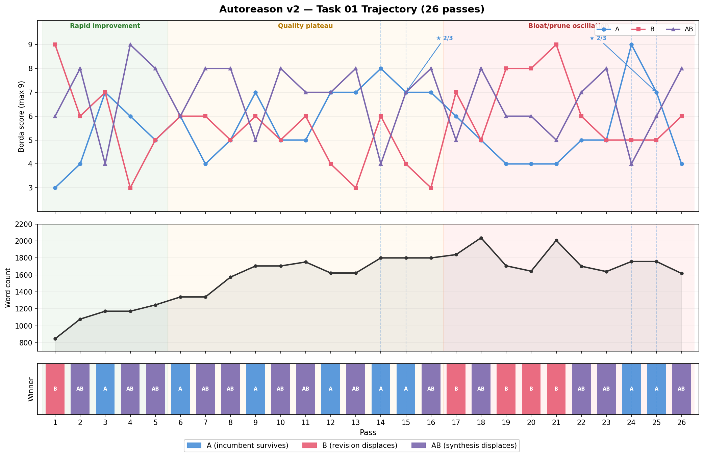

# Autoreason

**Autoresearch for subjective domains.**

Autoreason is an iterative refinement method for LLM-generated content where no objective metric exists. It constructs a subjective fitness function through independent blind evaluation — the same way science uses peer review where math can use proofs.

## The Core Idea

Generate a proposal (A). Have a fresh agent attack it to find problems. Have another fresh agent revise it based on valid criticisms (B). Have a third fresh agent synthesize the best of both (AB). Then have an independent judge — blind to which version is which — pick the one that best accomplishes the original task.

**A** is conservatism: the current version is fine, the changes made things worse. **B** is adversarial editing: the critique found real problems and the revision fixes them. **AB** is what happens when you ask an agent to be objective: both versions got some things right, here's a synthesis that keeps the best of each. The judge decides which of these three framings actually produced the best result, with no knowledge of which is which.

The winner becomes the new A. Repeat until A survives — it can no longer be improved by adversarial pressure.

## The Problem This Solves

LLMs exhibit compounding failure modes when used for iterative refinement on subjective work:

| Failure Mode | What Happens | Why It Happens |
|---|---|---|
| **Sycophancy** | Ask it to improve something and it strengthens whatever you hand it, regardless of whether the argument is actually sound | The model follows the implied instruction: "make this better" becomes "make this more of what it already is" |
| **Overcriticism** | Ask it to find problems and it always finds something, even when the work is sound | The instruction to critique is interpreted as an instruction to change — saying "this is fine" feels like task failure |
| **Overcompromise** | Ask it to synthesize two perspectives and it hedges everything, producing a mushy average instead of selecting the best answer per dimension | The model treats both inputs as equally valid and tries to include something from each, losing the sharpness of either |
| **Authorship bias** | An agent that wrote version A will defend it even while "incorporating feedback" from a critique | The drafting history in the context window creates a completion bias toward continuing the established pattern |
| **Scope drift** | Each iteration adds hedging, caveats, and complexity — the output bloats away from what was asked for | No anchor back to the original task; the model optimizes for "impressiveness" rather than "accomplishes the task" |
| **Context collapse** | After several review cycles, the output diverges from the original intent with no mechanism to detect or reverse the drift | Each round takes the previous round's output as input — by round 3, the original signal has decayed through layers of revision |

The output is shaped more by how you prompt than by what's actually better. There is no independent evaluation happening — just a mirror.

## How Autoreason Addresses Each Failure Mode

| Failure Mode | Architectural Fix |
|---|---|
| **Sycophancy** | The incumbent (A) competes against adversarial alternatives — the judge picks the best version, not the most polished one |
| **Overcriticism** | The strawman only finds problems. A separate Author B decides which criticisms are valid enough to act on. If the critique was wrong, the judge picks A and the criticism is discarded |
| **Overcompromise** | The synthesizer (AB) is one of three options, not the default. If the synthesis hedged too much, the judge picks A or B instead |
| **Authorship bias** | Every role is a fresh agent with no shared context. Author B never saw Author A's drafting process. The synthesizer doesn't know which version came first |
| **Scope drift** | Judges evaluate against the original task prompt — "which version best accomplishes what was asked for" — not "which is most thorough" |
| **Context collapse** | The original task prompt is the anchor throughout all passes. The incumbent (A) is always a candidate, so the loop can revert to stability at any point |

## Two Modes

**Quick pass (v1)** — A single cycle: generate A, strawman it, revise to B, synthesize AB, judge picks the best. Five LLM calls, ~2 minutes. Prevents the worst failure modes without the cost of iteration. Use this when you want "make this better without overcorrecting" — the agent equivalent of getting one round of peer review. Drift is prevented structurally: the original is always a candidate, so overcorrection gets caught by comparison rather than compounding through sequential revision.

**Convergence loop (v2)** — Repeats the cycle until the incumbent survives consecutive passes. Every role is a fresh isolated agent, judged by a 3-judge blind panel. More rigorous and more expensive. Use this when you need confidence that the output has survived sustained adversarial pressure — where there's no test suite or specification to anchor correctness, and the stakes justify the token cost.

Both modes share the same core architecture. v1 is one iteration of v2.

## Architecture

Every role is a fresh, isolated agent with no shared context. The artifact is the thread of continuity, not the agent's memory.

```
ORIGINAL TASK PROMPT (anchor — seen by all roles)
        │
        ▼
   ┌──────────┐
   │ Author A │   generate initial version
   └────┬─────┘
        │
        ▼ ══════════════════ LOOP ══════════════════
        │
   ┌────┴──────┐
   │ Strawman  │   fresh agent, sees only current A
   └────┬──────┘   finds problems — no fixes
        │
   ┌────┴──────┐
   │ Author B  │   fresh agent, sees task + A + critique
   └────┬──────┘   revises A to address valid criticisms
        │
   ┌────┴───────────┐
   │  Synthesizer   │   fresh agent, sees task + A + B (randomized)
   └────┬───────────┘   keeps the strongest elements of each
        │
        ▼
   ┌─────────────────────────────────────────────────┐
   │            Judge Panel (3 judges)                │
   │  fresh agents, blind evaluation                  │
   │  ranked choice + Borda count                     │
   │                                                  │
   │  chooses best of:                                │
   │    A  — the incumbent (unchanged)                │
   │    B  — the adversarial revision                 │
   │    AB — the synthesis (best of both)             │
   └────┬─────────────────────────────────────────────┘
        │
        ├── Winner = A → streak++
        └── Winner = B or AB → streak = 0, winner becomes new A
        │
        ▼  loop until streak = 2 (converged)
```

### Why It Works

| | Autoresearch | Autoreason |
|---|---|---|
| **Generate** | Mutate code | Produce A, B, AB |
| **Test** | Run experiment, check val_bpb | Independent judge panel evaluates |
| **Keep/revert** | Better metric → keep | Judges pick best → advance |
| **Anchor** | Last known good commit | Original task prompt |
| **Drift prevention** | Objective metric | Blind judges + incumbent always a candidate |

## Key Findings

Tested over 26 passes on a go-to-market strategy task (claude-sonnet-4, 3-judge panel).

**The loop works.** Pass 1 judges unanimously picked the revised version over initial generation (Borda 9-3-6). Early passes show genuine quality improvement.

**Fresh agents prevent authorship bias.** Author B re-emerged as winner at passes 17-21 after 15 passes of irrelevance. A persistent agent would have learned to defer.

**Bloat/prune oscillation.** On tasks with ambiguous scope, the synthesizer (AB) adds complexity while Author B prunes it. Word counts: 847 → 1800 → 1644 → 1758. The loop oscillates between "comprehensive" and "focused" without settling — a real signal that the task is underdetermined.

**Conservative tiebreak is load-bearing.** Incumbent wins ties. Removed 3 unnecessary churn events in 26 passes.



Full trajectory data, analysis, and design space matrix: [RESULTS.md](RESULTS.md)

Shareable project overview: [OVERVIEW.md](OVERVIEW.md)

## Prior Experiments (v1)

The v2 architecture was informed by ~1,800 LLM calls of earlier experiments that exposed specific problems:

- **Positional bias.** When the judge saw versions labeled "Version A (original)" and "Version B (revised)," it systematically favored B. Renaming them to neutral labels (Proposal 1, 2, 3) and randomizing presentation order eliminated this. This is why v2 judges see randomized numeric labels.
- **Single judge noise.** One judge's idiosyncratic preferences dominated outcomes. Runs with the same inputs produced different winners depending on which quirks the judge fixated on. This led to the 3-judge panel with Borda count aggregation.
- **Shared context contamination.** When the same agent served as both author and judge, it rubber-stamped its own revisions. The judge always agreed with the changes it had just made. This is why v2 uses fresh, isolated agents for every role.
- **No convergence signal.** v1 ran a fixed number of independent single-pass trials (Monte Carlo) but had no iterative loop. You could see that autoreason outputs were better than baselines, but couldn't answer "when should you stop?" v2 introduces the convergence loop to answer this.

Code and data from these experiments live in `experiments/v1/` and `experiments/prior/`.

## Repository Structure

```
├── README.md              ← you are here
├── OVERVIEW.md            ← shareable intro (starts with Karpathy hook)
├── RESULTS.md             ← full findings, trajectory data, design space matrix
├── tasks/                 ← task prompts used across all experiments
├── experiments/
│   ├── v2/                ← current: iterative loop, judge panel, fresh agents
│   │   ├── run_v2.py
│   │   ├── config_v2.yaml
│   │   ├── results_v2/   ← all artifacts per pass
│   │   ├── make_chart.py
│   │   └── trajectory_chart.png
│   ├── v1/                ← original: single-pass, single judge, Monte Carlo
│   │   ├── run.py
│   │   ├── config.yaml
│   │   └── results/
│   └── prior/             ← exploratory experiments (blind eval, comparison, matrix)
```

## Running

```bash
pip install litellm pyyaml

# Dry run
python experiments/v2/run_v2.py --task 1 --dry-run

# Single task, unlimited passes
python experiments/v2/run_v2.py --task 1

# Cap at 20 passes
python experiments/v2/run_v2.py --task 1 --max-passes 20
```

Requires `ANTHROPIC_API_KEY` in environment or `~/.hermes/.env`.

## Next Experiments

1. Convergence threshold 2 — confirm pass 15 was the right stopping point
2. Constrained task prompt — test if scope constraints eliminate oscillation
3. Mixed-model judge panel (sonnet + gpt-4o + gemini) — decorrelate judge biases
4. Monte Carlo — N runs same task, test convergence consistency
5. Different task types — generalizability

## License

MIT
