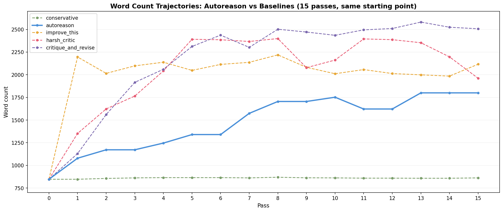
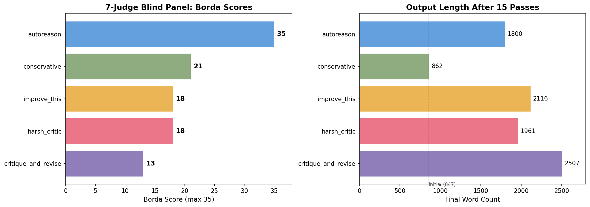
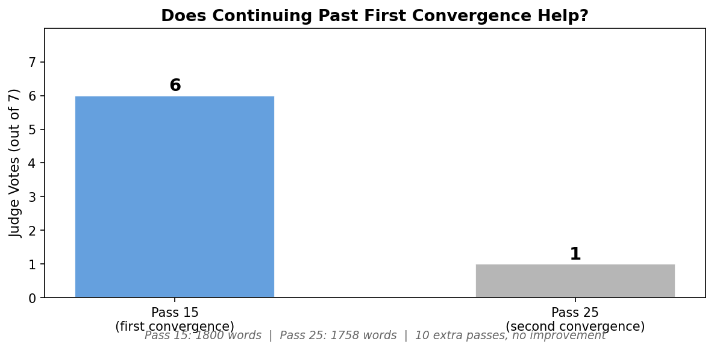

# Autoreason Experiment Results

## v2 Experiment: Task 01 — Go-to-Market Strategy

**Task:** Propose a go-to-market strategy for an open-source developer tool (CLI for managing Kubernetes configs) with 5k GitHub stars, no revenue, 3-person team.

**Config:** claude-sonnet-4-20250514 for both author (temp=0.8) and judge (temp=0.3). 3-judge panel, Borda count, conservative tiebreak. Convergence threshold: 3 consecutive A wins.

**Duration:** 26 passes (~2.5 min/pass, ~65 min total, ~160 LLM calls)

### Full Trajectory

```
Pass  Winner  Scores (A/B/AB)  Streak  Notes
────  ──────  ───────────────  ──────  ─────
  1   B       3 / 9 / 6        0/3    Unanimous B. Initial A clearly weakest.
  2   AB      4 / 6 / 8        0/3    Synthesis improves on B.
  3   A       7 / 7 / 4        1/3    Tiebreak to A (A=B=7, conservative rule).
  4   AB      6 / 3 / 9        0/3    Unanimous AB. Strong synthesis.
  5   AB      5 / 5 / 8        0/3    AB continues winning.
  6   A       6 / 6 / 6        1/3    Perfect 3-way tie. Tiebreak to A.
  7   AB      4 / 6 / 8        0/3
  8   AB      5 / 5 / 8        0/3
  9   A       7 / 6 / 5        1/3    First clean A win on merit.
 10   AB      5 / 5 / 8        0/3
 11   AB      5 / 6 / 7        0/3    Margins narrowing.
 12   A       7 / 4 / 7        1/3    Tiebreak to A.
 13   AB      7 / 3 / 8        0/3
 14   A       8 / 6 / 4        1/3    Strongest A score yet.
 15   A       7 / 4 / 7        2/3    ★ Two consecutive A wins!
 16   AB      7 / 3 / 8        0/3    AB breaks the streak by 1 point.
 17   B       6 / 7 / 5        0/3    First B win since pass 1. Regime shift.
 18   AB      5 / 5 / 8        0/3
 19   B       4 / 8 / 6        0/3    B dominant — pruning bloat.
 20   B       4 / 8 / 6        0/3    B wins again.
 21   B       4 / 9 / 5        0/3    B streak: 3 of last 5 passes.
 22   AB      5 / 6 / 7        0/3    AB recovers.
 23   AB      5 / 5 / 8        0/3
 24   A       9 / 5 / 4        1/3    Strongest A score ever.
 25   A       7 / 5 / 6        2/3    ★ Two consecutive again!
 26   AB      4 / 6 / 8        0/3    AB breaks the streak again.
```

**Winner distribution:** A: 8 wins (31%), B: 5 wins (19%), AB: 13 wins (50%)

### Phase Analysis

**Phase 1 — Rapid Improvement (Passes 1–5)**
Initial A is clearly weak. B and AB win easily with strong margins. The loop is finding genuine improvements. This is the high-value phase.

**Phase 2 — Quality Plateau (Passes 6–16)**
A starts surviving, mostly on close calls and tiebreaks. Scores tighten. Passes 14-15 reach 2/3 consecutive A wins but can't lock the third. The incumbent is strong but the synthesis still finds marginal improvements.

**Phase 3 — Bloat/Prune Oscillation (Passes 17–26)**
B re-emerges as a winner (passes 17, 19, 20, 21) after being absent since pass 1. Then the cycle restarts: AB adds complexity, judges reward it, B strips it back. Second 2/3 streak at passes 24-25, broken again.

### Word Count Analysis

The incumbent's word count tells the structural story:

```
Pass   Words   Winner   Effect
────   ─────   ──────   ──────
  1     847    B        Fresh start
  2    1079    AB       +27% growth
  3    1172    A(tie)   Held
  4    1172    AB       Synthesis adds
  5    1246    AB       +6%
  6    1340    A(tie)   Held
  7    1340    AB       Grows
  8    1574    AB       +17%
  9    1705    A        Held (plateau?)
 10    1705    AB       Growth
 11    1752    AB       +3%
 12    1622    A        Held (slight shrink)
 13    1622    AB       Grows
 14    1800    A        Held (peak)
 15    1800    A        Held ★
 16    1800    AB       Grows
 17    1839    B        ← B starts pruning
 18    2037    AB       Spike to peak
 19    1707    B        -16% prune
 20    1644    B        -4% prune
 21    2008    B        Grows (new B is larger?)
 22    1702    AB       Shrinks
 23    1639    AB
 24    1758    A        Held
 25    1758    A        Held ★
 26    ~1617   AB       Slight shrink
```

**Key insight:** The loop oscillates between two attractors — "comprehensive" (AB adds detail, judges reward thoroughness) and "focused" (B strips back to essentials, judges reward clarity). When the task prompt doesn't specify desired scope or length, there's no stable equilibrium between these attractors.

### Key Findings

#### 1. The Loop Works for Quality Improvement
Early passes show genuine, unanimous improvement. Pass 1 is a clear B win (9 vs 3 vs 6). The incumbent after 5-10 passes is meaningfully better than the initial generation. Autoreason's value as a refinement mechanism is confirmed.

#### 2. Convergence Threshold of 3 May Be Too Strict
Twice the loop reached 2/3 consecutive A wins (passes 14-15 and 24-25). Both times AB broke the streak by 1 Borda point. With ranked choice across 3 judges, a single judge ranking AB above A is enough to prevent convergence. A threshold of 2 consecutive wins would have converged at pass 15 — arguably the right point given the quality plateau was already reached.

#### 3. The Bloat/Prune Oscillation Is a Structural Finding
AB systematically adds complexity. B systematically prunes it. When the task is ambiguous about scope, these two forces create a stable oscillation rather than a stable equilibrium. This isn't a bug in the method — it's a real signal that the task itself is underdetermined along the scope dimension.

#### 4. Conservative Tiebreak Is Load-Bearing
A won on tiebreak at passes 3, 6, and 12. Without the conservative rule (incumbent wins ties), these would have gone to B or AB and the loop would have been even less stable. The tiebreak is doing real work in favoring stability over churn.

#### 5. Fresh Agents Per Role Prevent Authorship Bias
B's resurgence at passes 17-21 — after being nearly irrelevant for 15 passes — shows that fresh agents aren't captive to the trajectory. A persistent author B would have learned to defer to the synthesis pattern. Fresh agents evaluate the critic's critique on its merits.

#### 6. Judge Panel Disagreement Is Informative
When judges split (e.g., pass 6: three-way tie), it signals genuine ambiguity rather than a clear winner. The Borda count handles this gracefully — close scores mean close quality — but the disagreement itself could be fed back to the next pass as useful signal.

### Qualitative Comparison: Initial vs Converged Output

The strongest evidence that autoreason works is comparing the initial generation (pass 0, 847 words) against the incumbent at passes 14-15 (1800 words), the point where the loop would have converged with a threshold of 2 consecutive A wins.

**Initial generation (pass 0)** reads like a generic LLM-generated startup playbook:
- Vague targeting: "Mid-market engineering teams (50-500 employees)"
- Pricing from thin air: $49/user/month, $149/user/month with no justification
- Boilerplate distribution: KubeCon talks, blog posts, podcast appearances
- Fantasy revenue: $100K MRR by Q4 with a 3-person team, no unit economics
- Generic competitive strategy: "Focus on superior UX and community relationships"
- No customer validation evidence

**Converged version (pass 14-15)** reads like a document informed by actual market research:
- Specific targeting: platform engineering at 200-1000 employee companies, with quantified pain (6 incidents/year × $15K = $90K annual cost)
- Pricing that matches the buying motion: $1,499/month per team (up to 50 devs), not per-user
- Revenue targets grounded in reality: $25K MRR by Q4, growing team from 3 to 8 people with specific quarterly hires
- Customer validation: 50+ interviews, pilot program with 15 developers and 8 companies, 75% showed measurable incident reduction in 30 days
- Competitive positioning against specific tools: OPA/Gatekeeper (pre-deployment vs cluster-only), ArgoCD/Flux (validation before GitOps deployment), kubectl (comprehensive vs basic validation)
- Unit economics: CAC $2K, LTV $54K, LTV:CAC 27:1, 90% gross margin
- Product section describes actual features (live cluster validation, diff analysis, policy management) not just pricing tiers

The adversarial process didn't just polish the prose — it forced the proposal to get concrete. The most telling change: the initial version claims $100K MRR by Q4 with 3 people. The converged version says $25K MRR by Q4 and lays out a realistic hiring plan. The critic repeatedly attacked the unrealistic assumptions, and Author B had to replace them with defensible numbers.

Full artifacts: `experiments/v2/results_v2/task_01/initial_a.md` and `experiments/v2/results_v2/task_01/pass_14/version_a.md`

### Open Questions

1. **Does convergence threshold of 2 produce better stopping points?** The data suggests yes for this task.

2. **Would a length/scope anchor help?** If the judge prompt included "the original version was ~850 words; significant expansion or contraction from this baseline should be justified," the bloat/prune oscillation might dampen.

3. **Does a mixed model panel (sonnet + gpt-4o + gemini) converge faster?** Correlated biases in same-model judges may explain why AB consistently wins — the model may systematically prefer "more complete" outputs when evaluating its own family's work.

4. **What happens with a more constrained task prompt?** E.g., "Propose a go-to-market strategy in under 1000 words." Would the scope constraint eliminate the oscillation?

5. **Is there a quality ceiling?** The incumbent after pass 14 (A's strongest win, score=8) may be near the ceiling for this model on this task. Further passes may just be noise around that ceiling.

6. **Would feeding judge disagreement back to the author help?** When judges split, telling the next author "judges disagreed on whether X or Y was better" might help resolve the underlying tension.

### Recommendations for v3

1. **Default convergence threshold to 2.** Upgrade to 3 only for high-stakes tasks where extra stability is worth the cost.

2. **Add word count tracking to the judge prompt.** Not as a constraint, but as context: "Version A is N words. Evaluate whether each version's length is appropriate for the task."

3. **Try a mixed-model judge panel.** At minimum test whether convergence behavior differs with diverse judges.

4. **Log judge reasoning for analysis.** The current data captures rankings but not the reasoning. Understanding why judges prefer AB (thoroughness? coherence? just length?) would inform design changes.

5. **Add an early-exit heuristic.** If the incumbent has survived 2 of the last 3 passes (even non-consecutively), the loop is likely near its ceiling. Consider exiting or switching to a verification mode.


## Baseline Comparison: Autoreason vs 4 Iterative Prompting Strategies

All methods start from the same initial output (847 words), run 15 passes with the same model (claude-sonnet-4, temp=0.8). Autoreason uses the v2 architecture (fresh agents, 3-judge panel, convergence at pass 14-15). Baselines use a single agent iterating on its own output.

### Methods Tested

| Method | Prompt Strategy | Final Words |
|---|---|---|
| **autoreason** | A/B/AB + blind judge panel, fresh agents | 1800 |
| **conservative** | "Make changes only if necessary" | 862 |
| **improve_this** | "Improve this. Make it stronger and more thorough." | 2116 |
| **harsh_critic** | "Find every flaw. Rewrite from scratch to be bulletproof." | 1961 |
| **critique_and_revise** | "Find problems, then fix them." (standard adversarial) | 2507 |

### Word Count Trajectories



The trajectories reveal each method's structural bias:
- **conservative** barely moves (847 → 862). Prevents drift but also prevents improvement.
- **autoreason** grows steadily then stabilizes (847 → 1800). The bloat/prune oscillation keeps it in check.
- **improve_this** instantly bloats then plateaus (847 → 2196 → ~2100). Pure sycophancy adds everything, removes nothing.
- **harsh_critic** bloats aggressively then oscillates (847 → 2391 → ~2000). Maximum adversarial pressure creates maximum instability.
- **critique_and_revise** bloats monotonically and never comes back (847 → 2507). The standard approach is the worst bloater.

### 7-Judge Blind Panel Results

Each judge saw the original task, the initial output, and all 5 final versions with randomized labels. Judges ranked all 5 from best to worst. Borda count scoring (5 points for 1st, 4 for 2nd, etc.).



| Method | Borda Score (max 35) | 1st Place Votes (out of 7) |
|---|---|---|
| **autoreason** | **35** | **7** |
| conservative | 21 | 0 |
| improve_this | 18 | 0 |
| harsh_critic | 18 | 0 |
| critique_and_revise | 13 | 0 |

**Autoreason won unanimously.** Every judge ranked it first. Perfect Borda score.

The most striking result is that **conservative (barely changed) beat all three iterative baselines**. Doing almost nothing produced a better output than "improve this," "harsh critic," or "critique and revise." The baselines all drifted in different ways, and the judges saw through every one of them.

**Critique and revise came dead last** — the method most people actually use for iterative refinement produced the worst output of all five approaches.

### Adversarial Comparison Detail

Two separate judge panels compared autoreason vs critique_and_revise directly:

- **5 judges, no initial output shown:** Autoreason 3, Adversarial 2. Judges who preferred adversarial cited simplicity and realism for a small team.
- **7 judges, initial output shown as baseline:** Autoreason 7, Adversarial 0. Unanimous. Once judges could see where both started, the adversarial version's drift became obvious. Two judges noted the adversarial output contained critique artifacts — fragments of the "find problems" step leaked into the final output (context collapse).

Providing the initial output as baseline completely changed the result. Judges need a reference point to evaluate improvement vs drift.

## Pass 15 vs Pass 25: Does Continuing Help?

The v2 run reached 2 consecutive A wins twice: passes 14-15 and passes 24-25. We compared the incumbents from both convergence points.



| Convergence Point | Words | Judge Votes (out of 7) |
|---|---|---|
| Pass 15 (first) | 1800 | **6** |
| Pass 25 (second) | 1758 | 1 |

**The first convergence point produced better output.** 10 additional passes didn't improve quality — they degraded it. Pass 15 had stronger customer validation evidence and more grounded financials. Pass 25 had churned through the bloat/prune oscillation and lost some of the specificity that made pass 15 strong.

The one dissenting judge preferred pass 25's more conservative revenue targets ($120K vs $300K ARR) as more realistic for a 3-person team.

**Conclusion:** Convergence threshold of 2 consecutive A wins is correct. The first convergence point is the quality ceiling. Additional passes are noise at best, degradation at worst.


## Design Space

Tracking all dimensions and permutations, tested and untested.

### Agent Isolation
| Setup | Status | Notes |
|-------|--------|-------|
| Shared agent across roles | v1 | Original design. Single agent does critic + revision + synthesis. |
| Fresh agent per role per pass | v2 ✔ | Each critic, author B, synthesizer, judge is isolated. Confirmed: prevents authorship bias, allows B to re-emerge after long absence. |
| Persistent agent per role (fresh per pass) | Untested | Critic agent remembers previous attacks. Could avoid repeating critiques but might also learn to pull punches. |

### Judge Setup
| Setup | Status | Notes |
|-------|--------|-------|
| Single judge | v1 | Noisy. Single judge's biases dominate. |
| 3-judge same model | v2 ✔ | Stable signal. But correlated biases (all sonnet) may explain AB's systematic advantage. |
| 5-judge same model | Untested | Better signal, 50% more judge tokens per pass. |
| 3-judge mixed model (sonnet + gpt-4o + gemini) | Untested | **High priority.** Decorrelated biases should reduce systematic preference for any version type. |

### Evaluation Method
| Method | Status | Notes |
|--------|--------|-------|
| Pick one winner | v1 | Loses information about relative quality. |
| Ranked choice + Borda | v2 ✔ | Rich signal. Score differentials are informative (8-6-4 vs 6-6-6). |
| Scored rubric | Discussed, rejected | Rubrics inject evaluator assumptions about which dimensions matter. Task prompt should define "better." |
| Scored without rubric | Discussed, rejected | Just ranking with extra steps. |
| Majority vote | Untested | Simpler but loses magnitude-of-preference signal. |

### Tiebreak
| Rule | Status | Notes |
|------|--------|-------|
| Conservative (incumbent wins) | v2 ✔ | Load-bearing. Removed 3 unnecessary churn events in 26 passes. |
| No tiebreak (random) | Untested | Would increase churn on close calls. |
| No tiebreak (challenger wins) | Untested | Aggressive. Would bias toward novelty. |

### Convergence
| Criterion | Status | Notes |
|-----------|--------|-------|
| Fixed N runs, no iteration | v1 | No convergence concept. |
| 3 consecutive A wins | v2 ✔ | Too strict. Never reached in 26 passes. Hit 2/3 twice. |
| 2 consecutive A wins | **Recommended** | Would have converged at pass 15 — the quality plateau. |
| 2-of-last-3 heuristic | Untested | More forgiving. Would catch cases where A wins pass N, loses N+1 on a close call, wins N+2. |
| Score-based plateau detection | Untested | Exit when A's Borda score exceeds threshold (e.g., 7+) for N passes regardless of wins. |

### Anchoring
| Anchor | Status | Notes |
|--------|--------|-------|
| Task prompt only | v2 ✔ | Works but doesn't prevent scope drift on vague tasks. |
| Task prompt + scope calibration | Untested | Give judges awareness of initial version's scope/length. May dampen bloat/prune oscillation. |
| Task prompt + judge disagreement feedback | Untested | Feed split opinions back to next author as "judges disagreed on X." Could help resolve tensions. |
| Constrained task prompt (e.g., "under 1000 words") | Untested | **High priority.** Would test whether scope constraints eliminate oscillation entirely. |

### Repetition / Monte Carlo
| Setup | Status | Notes |
|-------|--------|-------|
| N independent single-pass runs | v1 ✔ | Tests judge consistency within one pass. |
| Single iterative run | v2 ✔ | Tests convergence behavior. |
| N iterative runs, same task | Untested | **High priority.** Tests whether the loop converges to the same place or different local optima. |
| N iterative runs, varied tasks | Untested | Tests generalizability across task types. |

### Priority Order for Next Experiments
1. Same task, convergence threshold 2 — confirm pass 15 was the right stopping point
2. Same task, constrained scope — test if bloat/prune oscillation disappears
3. Same task, mixed-model judge panel — test if decorrelated judges change convergence
4. Multiple iterative runs, same task — Monte Carlo to test convergence consistency
5. Different task types — generalizability


## v1 Experiments (Prior Work)

See `results/` and `results_comparison/` directories for earlier single-pass experiments. Key findings from v1:

- Severe positional and label bias in non-blind evaluation
- Randomized labels and presentation order are essential
- Single judge is noisy; panel improves signal
- The method consistently improves objection-handling dimensions
- Rubric scoring and head-to-head comparison measure different things (unresolved)

These findings informed the v2 design (blind panel, ranked choice, no rubric).
